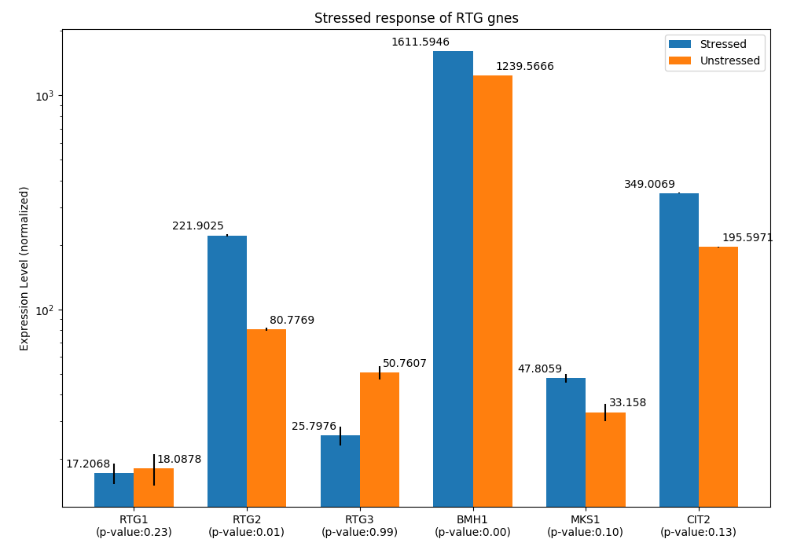

# RNASeq data visualization for Differential Gene Expression in RTG pathway proteins


> *This figure is produced by [RNAseq_RTG_expression/analysis_RNA-Seq.ipynb](docs/analysis_RNA-Seq.ipynb)*

## Whole-genome RNA sequencing under normal and osmotic stress condition in yeast

Whole-genome RNA sequencing was performed under normal conditions and osmotic stress [4] (GEO database's access number: GSE102475). This paper is selected because all RTG-related gene expressions are covered in this research, and this paper also provides stress condition that is informative to investigate the range of expressions of RTG elements.

The original data is downloaded and stored at <a href="RNAseq_RTG_expression/data/Single Cell RNAseq_yeast_GSE102475.xlsx">Single Cell RNAseq_yeast_GSE102475.xlsx</a> [4].


## RTG differential gene expression


By using the differential gene expression [5], the relative expressions of Rtg1, Rtg2, Rtg3, Bmh1, Mks1 and Cit2 are analyzed by Discrete distributional differential expression [5] (D3E). Noted that Cit2 gene is used as an indicator of RTG response, while this procedure aims to get the relative expressions between RTG components rather than the exact RTG response. Zeros in RNA readouts from [4] were removed and filtered by genes of interest. The filtered data is summarized in the txt file called [`SingleCellRNAseq_yeast_GSE102475_LabelSep.txt`](src/data/RNAseq_RTG_expression/data/SingleCellRNAseq_yeast_GSE102475_LabelSep.txt). Further, differential gene expression analysis is done by D3E method by the following command


```terminal
python D3ECmd.py SingelCellRNAseq_yeast_GSE102475_LabelSep.txt  SingelCellRNAseq_yeast_GSE102475_LabelSep.out  Stressed Unstressed -m 1 -t 0 -z 0 -n 1 -v
```

the installation details can be found at https://github.com/hemberg-lab/D3E [5]. Alternatively, the filtered RNA seq data can be processed by D3E online service (https://www.sanger.ac.uk/sanger/GeneRegulation_D3E/).

The mean expression values (`mu1` in [analysis_RNA-Seq.ipynb](docs/RNAseq_RTG_expression/analysis_RNA-Seq.ipynb)) are summarized in [RNAseq_RTG_expression.csv](https://github.com/ntumitolab/RetroSignalModel.jl/blob/main/src/data/RNAseq_RTG_expression.csv) that contains the relative expression levels of RTG components under normal and stressed conditions.
